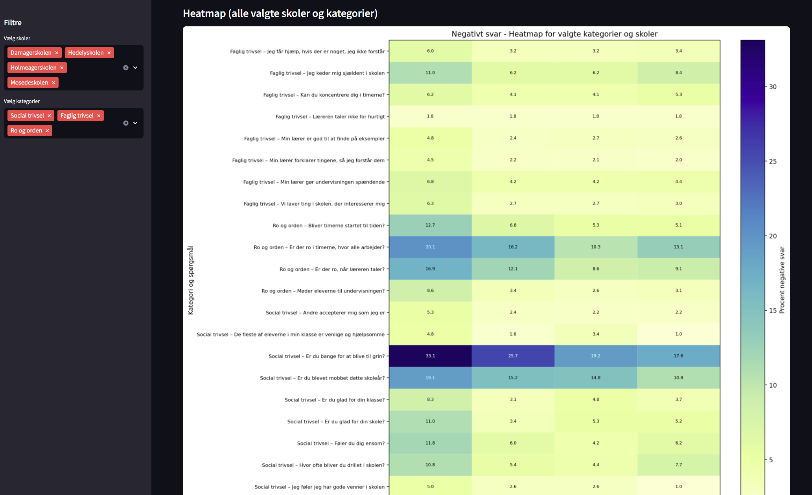

# Dataanalyse - Sammenligning af offentlige trivelsdata for skoler i Greve Kommune, skoleåret 2024/2025

Baseret på data fra DR's [værktøj for offentlige trivelsdata](https://www.dr.dk/feature/skole-trivsel-2025) baseret på data for skoleåret 2024/2025 fra Uddannelsesstatistik.

## Screenshots




## Kør lokalt

Installer streamlit

```bash
pip install streamlit pandas matplotlib
```

Kør appen

```bash
streamlit run streamlit_app.py
```
